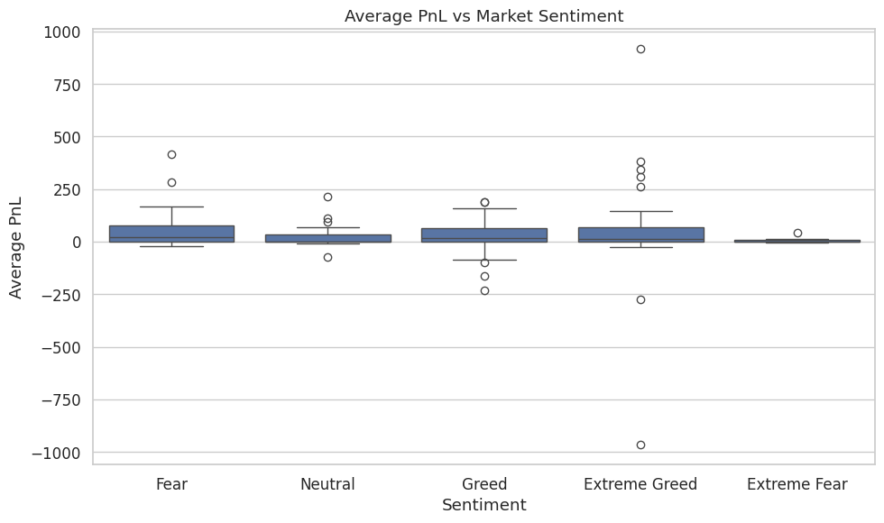
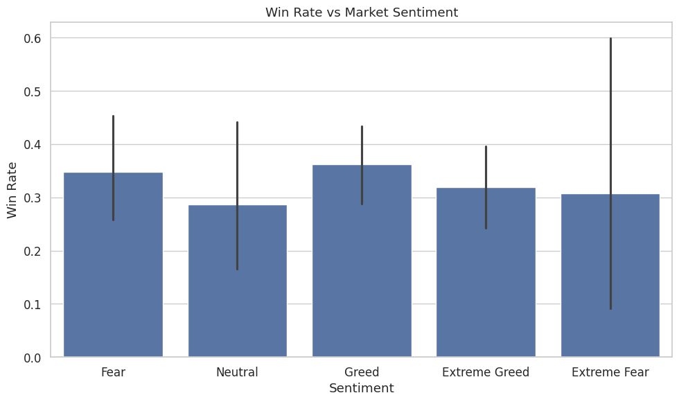
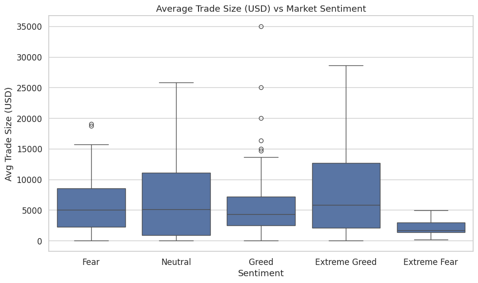

#  Trader Behavior vs Bitcoin Market Sentiment

This project analyzes the relationship between trader performance and market sentiment (Fear vs Greed) using real trade data from Hyperliquid and sentiment labels from the Fear & Greed Index.


## Objective

Understand how trader profitability, risk behavior, and win rate change based on market sentiment — helping inform smarter strategies in the Web3 trading ecosystem.


## Datasets: 

### 1. **Historical Trader Data** 
- [Link](https://drive.google.com/file/d/1IAfLZwu6rJzyWKgBToqwSmmVYU6VbjVs/view?usp=sharing)
- Columns: `account`, `execution_price`, `size_usd`, `side`, `timestamp_ist`, `closed_pnl`, `fee`, etc.
- Granularity: Individual trades

### 2. **Fear & Greed Index**
- [Link](https://drive.google.com/file/d/1PgQC0tO8XN-wqkNyghWc_-mnrYv_nhSf/view?usp=sharing)
- Columns: `date`, `classification` (renamed to `sentiment`: Fear or Greed)
- Granularity: Daily sentiment label


## Methodology

### 1. **Data Cleaning**
- Fixed column name inconsistencies
- Converted `timestamp_ist` to valid datetime
- Removed rows with invalid timestamps (e.g., `1970-01-01`)
- Extracted clean `date` to align with sentiment data

### 2. **Data Integration**
- Merged trade data with sentiment data on `date`
- Used only overlapping dates (2023–2025)

### 3. **Feature Engineering**
- Flagged profitable trades (`closed_pnl > 0`)
- Calculated:
  - Daily average PnL
  - Daily total PnL
  - Win rate (% of profitable trades)
  - Average trade size
  - Average fee

### 4. **Exploratory Analysis**
- Grouped metrics by `date` and `sentiment`
- Compared performance patterns during `Fear` vs `Greed`


## Visualizations

1. **Boxplot – PnL vs Sentiment**
   

2. **Barplot – Win Rate vs Sentiment**
   

3. **Boxplot – Trade Size vs Sentiment**
   


##  Insights

```text
Insights Summary:

When market sentiment is **FEAR**:
   - Average PnL: $56.31
   - Win Rate: 34.81%
   - Average Trade Size: $6014.62

 When market sentiment is **NEUTRAL**:
   - Average PnL: $28.28
   - Win Rate: 28.67%
   - Average Trade Size: $7191.75

 When market sentiment is **GREED**:
   - Average PnL: $29.15
   - Win Rate: 36.24%
   - Average Trade Size: $6352.09

 When market sentiment is **EXTREME GREED**:
   - Average PnL: $46.83
   - Win Rate: 31.96%
   - Average Trade Size: $7954.34

 When market sentiment is **EXTREME FEAR**:
   - Average PnL: $8.95
   - Win Rate: 30.75%
   - Average Trade Size: $2191.15

```
**Greed leads to higher profitability and larger trades**, while **Fear is associated with caution, smaller trades, and lower win rates** — suggesting reduced confidence or defensive trading.


## Tech Stack

- Python 3.11  
- pandas  
- seaborn  
- matplotlib  
- numpy  

## Conclusion
This analysis highlights how market sentiment influences trader behavior. Understanding this dynamic can help design smarter trading algorithms and enhance decision-making under uncertainty.


